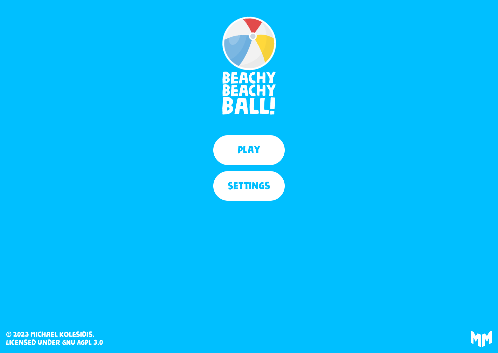
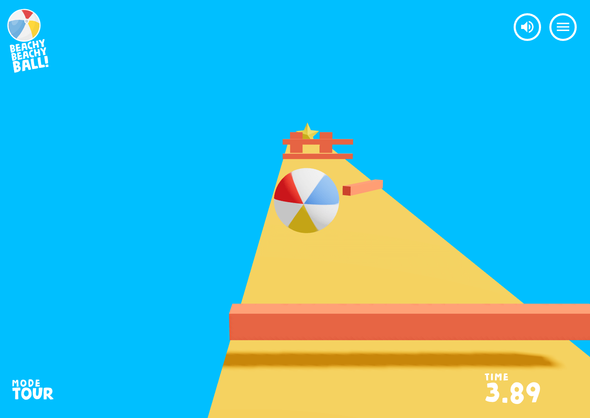
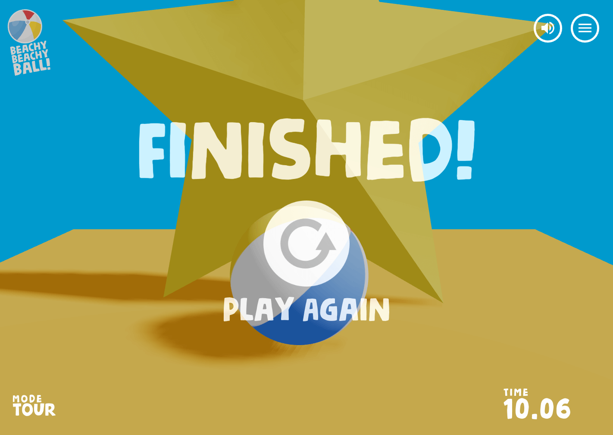
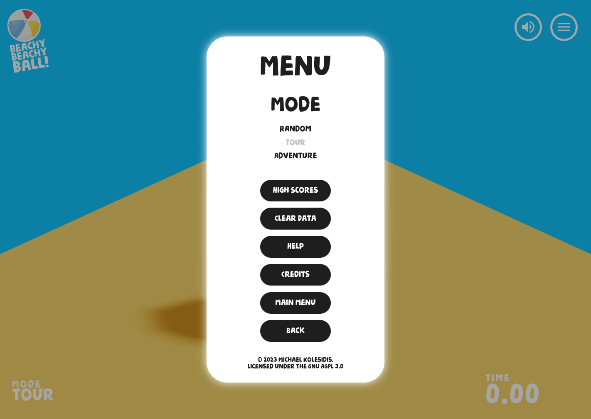

## Features

## Technologies

The core technologies used are _JavaScript_ and _WebGL_. The following libraries and tools are used:

| Name              | License | Description                                  |
| ----------------- | :-----: | -------------------------------------------- |
| React             |   MIT   | Component-based, front-end interface library |
| Three.js          |   MIT   | 3D graphics API for the web, based on WebGL  |
| React Three Fiber |   MIT   | A React renderer for Three.js                |
| Drei              |   MIT   | Useful helpers for React Three Fiber         |
| Zustand           |   MIT   | State management                             |
| Vite              |   MIT   | Frontend development tooling                 |

## Screenshots

## Roadmap

## Gameplay and Rules

The player controls a beach ball, and has to hit the star at the end of the level in order to win, while avoiding a variety of obstacles. If the ball falls off the level, the game restarts with the ball in its initial position.

### Controls

|  Button(s)   |           Action            |
| :----------: | :-------------------------: |
| ←↑→↓ or WASD |            Move             |
|    Space     |            Jump             |
|    Enter     |  Start game (on main menu)  |
|      M       |         Mute/Unmute         |
|      R       |           Restart           |
|      P       |   Show performance stats    |
|     Esc      | Toggle menu modal (in game) |

## Software Used

A non-exhaustive list of all the software that was used during the development of _Beachy Beachy Ball_.

- Visual Studio Code
- Figma
- Blender
- Adobe Photoshop
- Inkscape
- Google Chrome
- Microsoft Edge
- Mozilla Firefox

## Assets

All the assets used (3D models, images etc.) are either using Creative Commons / Public Domain or they were created by me.

## 💖 Support the Project

Thank you so much for your interest in my project! If you want to go a step further and support my open source work, buy me a coffee:

## License

Copyright (c) 2023 Michael Kolesidis 
Licensed under the [GNU Affero General Public License v3.0](https://www.gnu.org/licenses/agpl-3.0.html).
